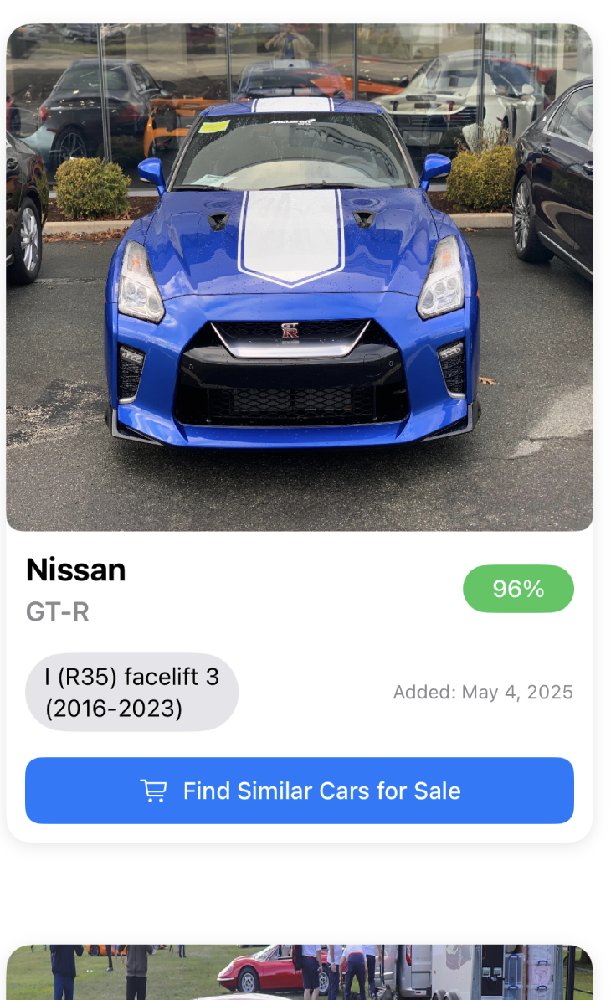

<a name="readme-top"></a>

# 🚘 Car IQ

<div align="center">
<!-- Add sample image here -->
  
  <h3 align="center">AI-powered Car Recognition App</h3>
  <p align="center">Snap or upload a photo of a car to identify its brand, model, generation, and year with high accuracy.</p>
</div>

## 🔎 About The Project

Car IQ is an iOS mobile application that uses AI and computer vision to detect and recognize cars from images. The user can take a picture of a car or upload one from their gallery, and the app will identify key attributes such as:

- 🚗 Car Brand (e.g. Nissan)
- 🏷️ Model (e.g. GT-R)
- 🕓 Generation and Year Range (e.g. I (R35) facelift 3, 2016–2023)
- ✅ Confidence Score (e.g. 96%)

It also offers features like Firebase authentication, cloud image storage, and a direct link to search similar cars for sale. CarIQ uses the CarNET API to perform vehicle identification by uploading images to the API and retrieving structured car information.

---

## 🚀 Built With

<p align="center">
  
  
  
  
  
</p>

---

## 📂 Project Structure

```
cardentification/
├── Core/
│   ├── CarListings/       # Views for displaying car listings
│   ├── MainTabBar/        # SwiftUI main tab view
│   ├── Profile/           # Profile interface
│   └── SnapCarPhoto/      # Camera interface for snapping photos
├── Config.xconfig         # App configuration settings (update with your own)
├── Info.plist             # App metadata and permissions
├── GoogleService-Info.plist # Firebase configuration
```

---

## 🧰 Getting Started

To run this app locally:

### Prerequisites

- macOS with **Xcode** installed
- Firebase project with Auth and Firestore
- CarNET API credentials

### Setup

1. Clone the repository

```bash
git clone https://github.com/mingleg7756/cardentification.git
cd cardentification
```

2. Open the project in Xcode

```bash
open cardentification.xcodeproj
```

3. Replace the `GoogleService-Info.plist` file with your Firebase config

4. Update your own `Config.xconfig` with the necessary API keys or variables

5. Build and run on a real device or simulator

---

## 👥 Team & Acknowledgments

### Team Members

- Ming
- Anthony
- Anas
- Robert
- Ye Htut

### Special Thanks

- **CUNY Tech Prep Instructors** for their guidance and support
- **CarNET API** for enabling AI-based car identification
- **Firebase** for robust backend infrastructure

<p align="right"><a href="#readme-top">Back to top</a></p>
